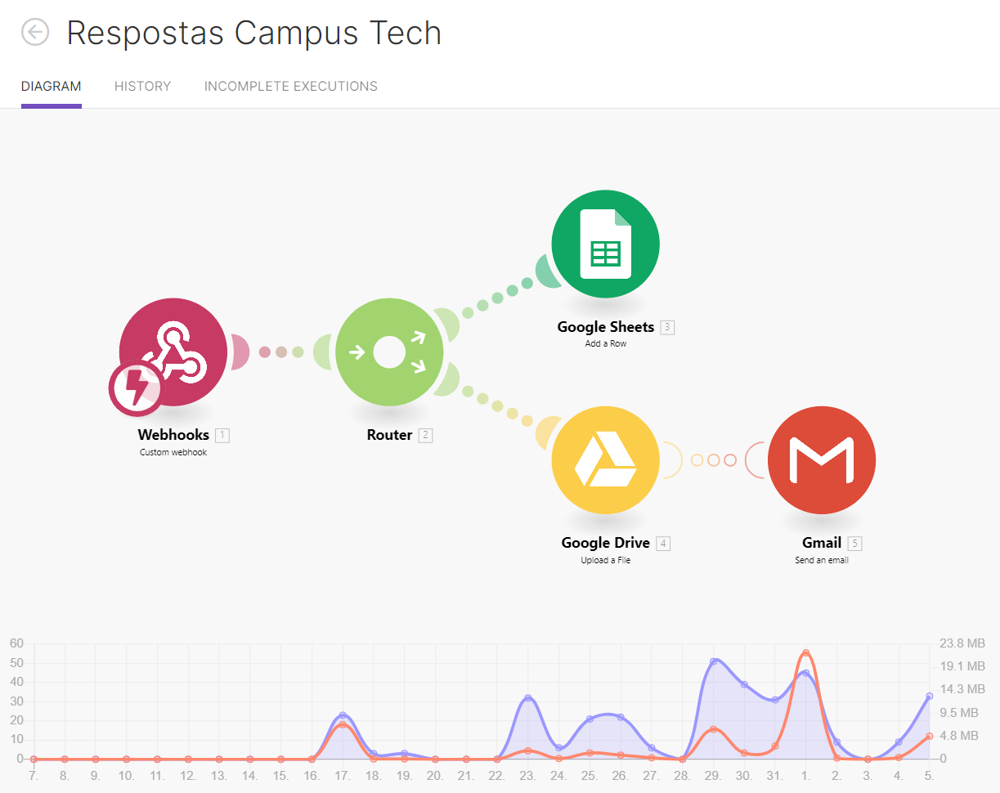

# 1) Landing Page do Projeto Campus Tech
Essa é uma pagina para o projeto Campu Tech que tem por objetivo apresentar o projeto e coletar inscritos.

## 2) Capa do Projeto

## 3) Mockup Utilizado como referência
Link: https://www.canva.com/design/DAE_GhznM3o/7WU1Ihw5vt_qdzncJzjhrQ/view?utm_content=DAE_GhznM3o&utm_campaign=designshare&utm_medium=link&utm_source=homepage_design_menu

## 4) Commits do Projeto
A lista do que foi trabalhado nesse projeto encontra-se na página "list commits".

## 5) Detalhes Referentes a Utilização da Landing Page
Essa landing page possui um formulário de inscrição no qual foi utilizado um API para recebimento e gravação dos dados.

No arquivo js/validatform.js está a API de envio dos dados e o link "https://hook.us1.make.com/yfvgtvpc8hg5te3na3uy4ntjxxt72knz" foi o webhook utilizado para receber a informação.

### 5.1) Como foi Configurado o Recebimento e Gravação das Respostas
Dentro da plataforma "Integromat" foi configurado o seguinte fluxo para recebimento e envio dos dados:

O webhook foi configurado para receber o apontamento após o envio dos dados no formulário do site, após isso, ele enviará os dados estruturados para uma planilha no google sheets e gravar o questionário de diligência em uma pasta no google drive. Além disso, caso haja algum erro na gravação dos dados ele acionara via e-mail.

*OBS: O integromat foi só uma opção utilizada no projeto para receber os dados, porém fica a cargo da utilização escolher o back-end para fazer essa gravação de dados.